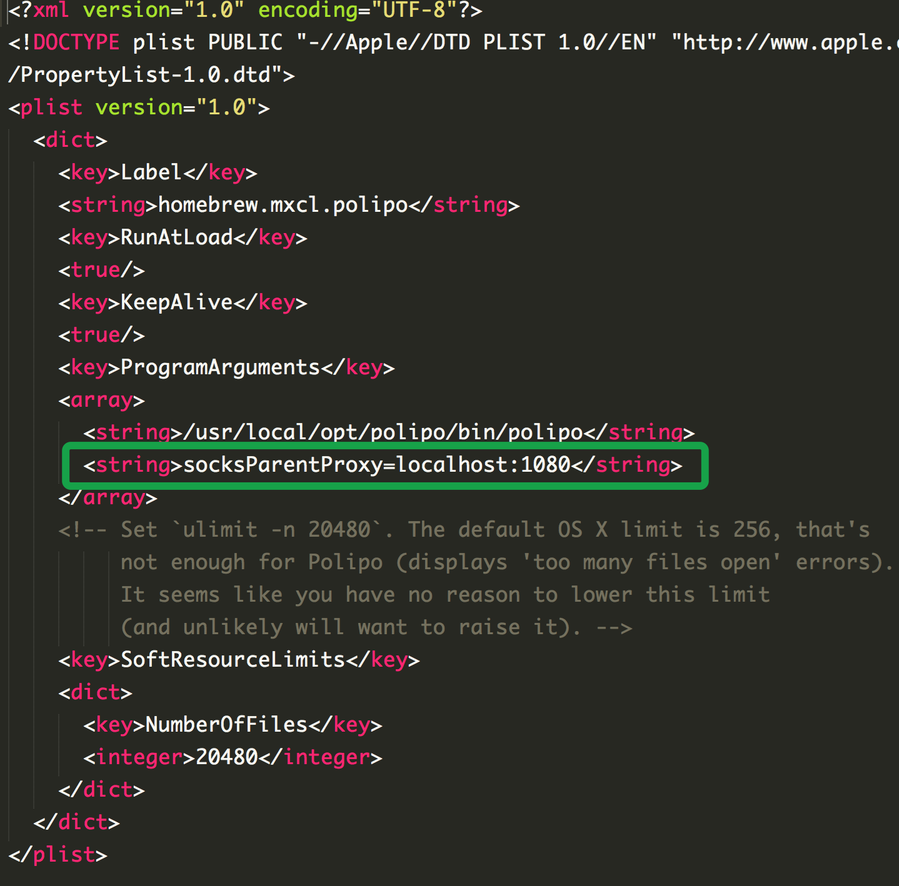

## Shadowsocks

```
brew install shadowsocks-libev
vi /usr/local/etc/shadowsocks-libev.json
```

```
{
  "server":" 服务器地址 ",
  "server_port": 服务器端口,
  "local_port":1080,
  "password":" 服务器密码 ",
  "timeout": 服务器超时时间,
  "method":"服务器加密方式"
}
```

添加开机启动

```
ln -sfv /usr/local/opt/shadowsocks-libev/*.plist ~/Library/LaunchAgents
launchctl load ~/Library/LaunchAgents/homebrew.mxcl.shadowsocks-libev.plist
```

ss-local 的路径为

```
/usr/local/opt/shadowsocks-libev/bin/ss-local
```

## polipo

将 SS 的 SOCKS5 代理转为 http 代理

```
brew install polipo
vi /usr/local/opt/polipo/homebrew.mxcl.polipo.plist
```

为 polipo 添加命令行参数：socksParentProxy=localhost:1080



添加开机启动

```
ln -sfv /usr/local/opt/polipo/*.plist ~/Library/LaunchAgents
launchctl load ~/Library/LaunchAgents/homebrew.mxcl.polipo.plist
```

在系统中添加开启、关闭代理的 Shell 脚本

在 .zshrc 或者 .bashrc 中添加两个命令 start_proxy, stop_proxy

```
function apply_proxy() {
  export http_proxy=$all_proxy
  export https_proxy=$all_proxy
  export ftp_proxy=$all_proxy
  export rsync_proxy=$all_proxy
}

function start_proxy() {
  export all_proxy="http://127.0.0.1:8123"
  apply_proxy
}

function stop_proxy() {
  export all_proxy=
  apply_proxy
}
```

## 生成 PAC 文件

生成 PAC 文件的工具有很多，这里使用 clowwindy 的 gfwlist2pac，它能在 O(1) 能完成查找

```
pip install gfwlist2pac
```

执行脚本

[gen_pac.sh](https://raw.githubusercontent.com/timqi/Notes/master/experience/proxy/gen_pac.sh)

上面脚本生成结合 gfwlist 与用户自定义规则并且使用 AdBlock 算法的 PAC 文件，需要将用户规则列表 USER_RULE_LIST，代理地址 PROXY，与最终 PAC 文件的补充完整并运行
